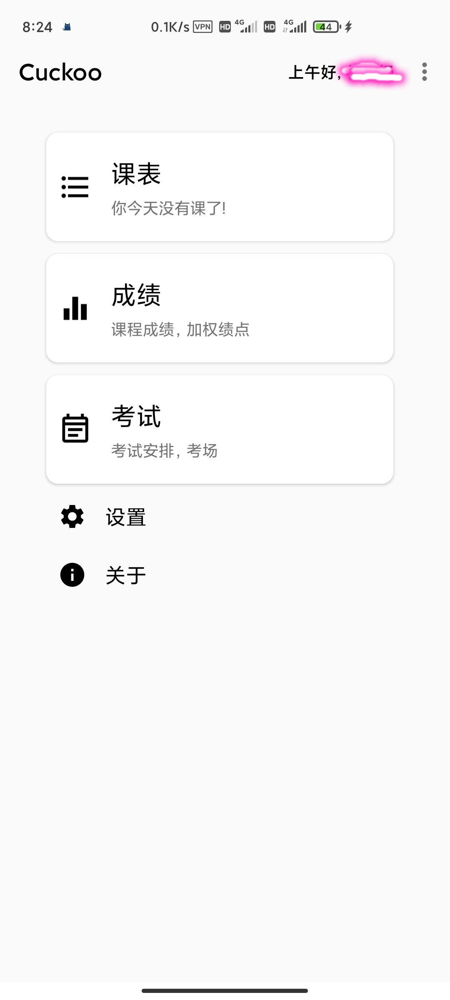
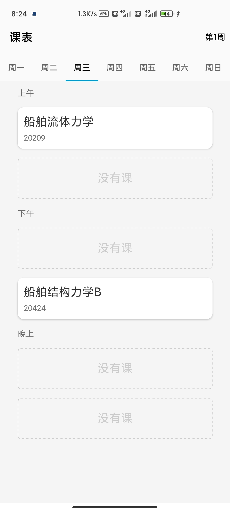

# 项目介绍

基于强智教务系统 API 的查课表、查成绩和查考试安排的安卓客户端。

# 开发进度
- [x] 登录/登出功能
- [x] 基本完成查课表功能
- [ ] 完善查课表功能(缓存课表、友好体验等)
- [ ] 查成绩功能
- [ ] 查考试安排功能
- [ ] 设置页面
- [ ] 关于页面
- [ ] 版本更新相关
- [ ] 主题功能(夜间模式)
- [ ] 针对重交的免密登录功能

# 运行截图

